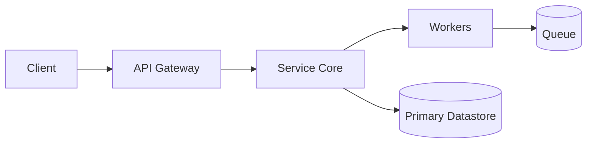
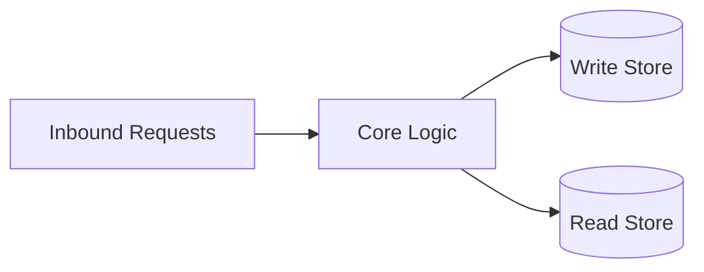
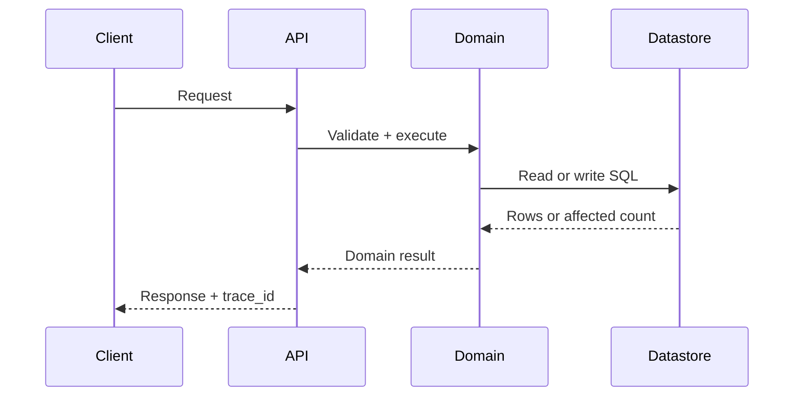
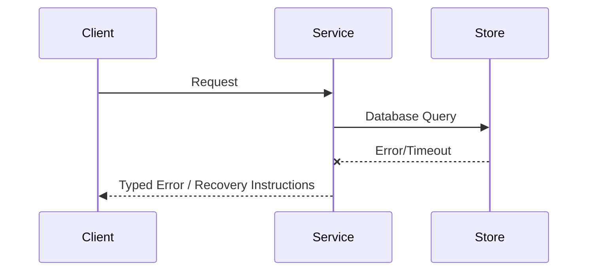

# Architecture

## Direction
library

## What This Project Is
dactyl-db is a small Rust application driver: one normalized operation surface over a Dactyl-owned pure-Rust local store and Vercel Neon. It is not a general SQL framework or database-administration layer.

Architectural principles:
- **Simplicity**: Keep components focused and reusable.
- **Modularity**: Clearly defined interface boundaries and dependency separation.
- **Reliability**: Graceful failure handling and thorough verification.
- **Backend-neutrality**: local and Neon adapters receive the same SQL, parameters, operation kinds, opaque atomic batches, and optional caller-owned context; backend-specific handles remain private.
- **Context separation**: the physical `DatastoreRoute` remains distinct from the versioned opaque `StorageContext`. Local storage ignores cloud-only payloads, while Neon forwards the validated envelope without interpreting its fields.

## Current Facts
- Runtime/languages: Rust
- Detected surfaces/framework hints: to be confirmed
- Product type: to be confirmed

## Architecture Map
This project's architecture consists of the following key layers/directories:
- `src/`: Main source directory containing primary logic.
- `tests/`: Integration and unit test suite.

## Data Flows
- The application supplies SQL, bound values, and caller-owned schema operations.
- Dactyl selects the local or Neon adapter and enforces the operation/access boundary.
- For Neon, Dactyl validates the context envelope, attaches it to `/query` and
  `/batch`, and fails closed before transport when it is absent or malformed.
- The adapter returns normalized rows, explicit write results, typed errors, or an ordered atomic result.

## Strongest Existing Primitives
- Define the strongest existing primitives in the codebase (e.g., helper utilities, base controllers, data access layers).

## Topology

## Store Boundaries

## Happy Path Sequence

## Error Path

## Execution Path
- Ingress parse + validation:
- Policy/interlock checks:
- Core execution + persistence:
- Verification and artifact emission:

## Concurrency and Runtime Model
- Execution model: each free `read` / `write` call constructs a short-lived adapter for the ambient route and drops it on return; explicit `Connection` scopes several application operations to one route.
- Isolation boundaries: Dactyl keeps no process-global cache and exposes no backend handle. Local mutating operations take a bounded file lock, execute against a candidate snapshot, and publish through a checksummed journal; `Connection::atomic` commits only after every operation succeeds.
- Backpressure strategy: owned by the backend or Neon service; Dactyl does not retry or schedule work.
- Shared state synchronization: none at the Dactyl layer.

## Deployment Topology
- Runtime units: none (library).
- Region/zone model: n/a.
- Rollout strategy: library releases via release-plz.
- Rollback trigger and blast-radius scope: callers pin a dactyl version; breaking changes are recorded in CHANGELOG.md.

## Data and Contracts
- Inbound contracts (application calls): `read`, `write_result`, `atomic`, `OpenOptions`, `StorageContext`, and owned row/result values.
- Outbound dependencies (datastores/queues/external APIs): Dactyl-owned Rust snapshot/WAL local storage and Neon/Propodus HTTP transport; no SQLite C family dependency.
- Data ownership boundaries: callers own schema definitions and migration policy; Decapod owns context meaning; Propodus owns cloud authorization; Dactyl executes only the documented caller-supplied schema subset and physical atomicity.
- Schema evolution + migration policy: outside Dactyl's scope.

## ADR Register
| ADR | Title | Status | Rationale | Date |
|---|---|---|---|---|
| ADR-001 | Ambient-env routing contract (DATASTORE/DATASTORE_ROUTE/DATASTORE_TOKEN) | Accepted | Single authoritative selector; no init(); per-call adapters for session isolation (dactyl #26) | 2026-08-01 |
| ADR-002 | Thin application API: read(sql, params) + write(sql, params) | Accepted | One uniform read/write surface for SQLite and Neon; administration remains outside the crate (dactyl #47) | 2026-08-01 |
| ADR-003 | Backend-neutral Adapter trait | Proposed | New backends (redis, mysql, cassandra) add one module + one DATASTORE arm; public surface unchanged | 2026-08-01 |
| ADR-004 | Pure-Rust local engine with opaque atomic batches | Accepted | Avoid SQLite C/rusqlite build cost while preserving caller-owned schema execution, local durability, read-only enforcement, and a Neon-parity proof seam (#51-#57) | 2026-08-11 |
| ADR-005 | Opaque storage-context forwarding | Accepted | Keep physical route configuration and cloud tenancy separate: Dactyl validates only a versioned envelope, ignores it locally, forwards it to Neon, and leaves authorization semantics to Propodus (#64) | 2026-08-11 |
| ADR-006 | Local fixture completeness before live Propodus | Accepted | Issues #57 and #64 are complete for the local store and the offline Neon mock: CAS is a zero-row observation, concurrent writers share a file lock, cleanup is `DROP`, and live Vercel Neon/Propodus proof is a separate deployment issue | 2026-08-12 |

## Delivery Plan (first 3 slices)
- Slice 1 (ship first):
- Slice 2:
- Slice 3:

## Risks and Mitigations
| Risk | Likelihood | Impact | Mitigation |
|---|---|---|---|
| Contract drift across components | Medium | High | Spec + schema checks in CI |
| Runtime saturation under peak load | Medium | High | Capacity model + load tests |

<!-- decapod:capability-overlay:persistent-state:start -->

## Persistent State Architecture Overlay

### State Ownership
- Each entity type MUST have a designated state owner
- State ownership boundaries MUST be explicitly documented
- Cross-boundary state access MUST go through defined interfaces

### Transaction Boundaries
- All multi-entity mutations MUST occur within explicit transactions
- Transaction boundaries MUST be documented in ARCHITECTURE.md
- Compensating transactions for distributed operations

### Storage Abstraction
- Storage ownership, consistency behavior, and access boundaries MUST be explicit
- Portability or swappable implementations are project decisions, not universal requirements
- Migration and rollback treatment MUST match the selected storage technology
<!-- decapod:capability-overlay:persistent-state:end -->

<!-- decapod:codebase-attestation:start -->

## Codebase Attestation

- Repository signal fingerprint: `fa4e292ece7718d0e22211ea009236b62477b5a1d0453b3c7f6291b751d3bde6`
- Significant implementation surfaces: `.github/` (2 files), `Cargo.lock/` (1 files), `Cargo.toml/` (1 files), `README.md/` (1 files), `src/` (7 files)
- Refreshed from the current codebase by `decapod specs.refresh`
<!-- decapod:codebase-attestation:end -->
