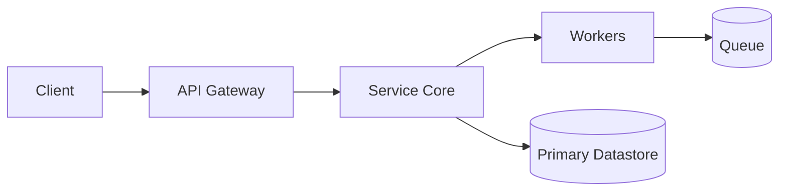
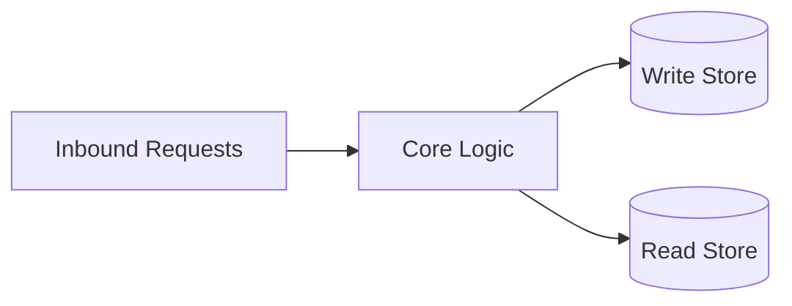
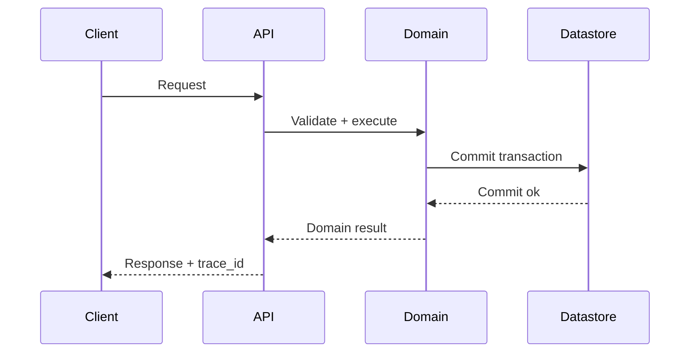
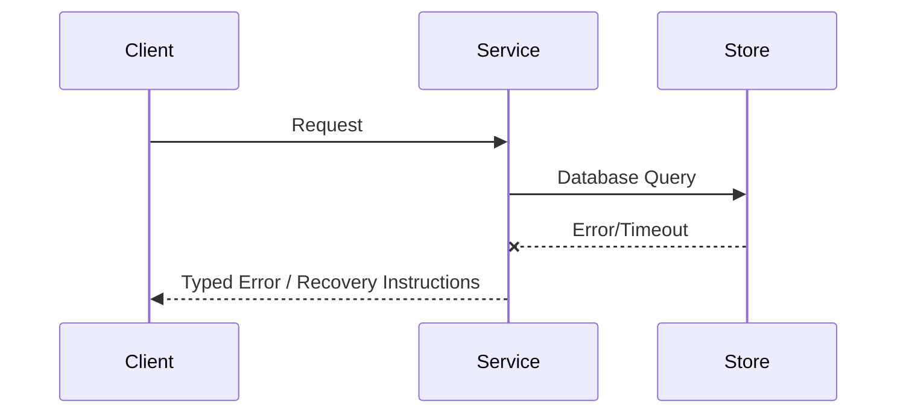

# Architecture
## Direction
library

## What This Project Is
dactyl-db is the single SQL-vendor-agnostic Rust persistence framework: one `query(sql, params)` surface over any structured-query-language backend. SQLite and Neon ship today; Redis, MySQL, and Cassandra are planned behind the same facade.

Architectural principles:
- **Simplicity**: Keep components focused and reusable.
- **Modularity**: Clearly defined interface boundaries and dependency separation.
- **Reliability**: Graceful failure handling and thorough verification.
- **Backend-neutrality**: The public API never changes per backend; a new backend is one `Adapter` module plus one `DATASTORE` match arm.

## Current Facts
- Runtime/languages: Rust
- Detected surfaces/framework hints: to be confirmed
- Product type: to be confirmed

## Architecture Map
This project's architecture consists of the following key layers/directories:
- `src/`: Main source directory containing primary logic.
- `tests/`: Integration and unit test suite.

## Data Flows
- Inbound request/command parses and validates at the entrypoint.
- Core runtime handles business logic and initiates queries or state changes.
- Storage adapter reads or writes data to the underlying persistence layers.

## Strongest Existing Primitives
- Define the strongest existing primitives in the codebase (e.g., helper utilities, base controllers, data access layers).

## Topology

## Store Boundaries

## Happy Path Sequence

## Error Path

## Execution Path
- Ingress parse + validation:
- Policy/interlock checks:
- Core execution + persistence:
- Verification and artifact emission:

## Concurrency and Runtime Model
- Execution model: each `query` / `execute` / `transaction` call constructs a fresh short-lived adapter for the ambient `DATASTORE` selection and drops it on return.
- Isolation boundaries: no process-global connection cache, so workspace/session isolation is automatic and the public surface is `Send + Sync` without locks.
- Backpressure strategy: N/A at the facade level; Neon adapter relies on the underlying HTTP client.
- Shared state synchronization: none — adapters own their connections for the duration of a call; SQLite serializes its connection behind an internal `Mutex` only because `rusqlite::Connection` is `!Sync`.

## Deployment Topology
- Runtime units: none (library).
- Region/zone model: n/a.
- Rollout strategy: library releases via release-plz.
- Rollback trigger and blast-radius scope: callers pin a dactyl version; breaking changes are recorded in CHANGELOG.md.

## Data and Contracts
- Inbound contracts (CLI/API/events): `query(sql, params)`, `execute(sql, params)`, `transaction(&[Statement])`, `query!` macro.
- Outbound dependencies (datastores/queues/external APIs): SQLite (rusqlite, bundled) and Neon/Propodus (reqwest, blocking+rustls-tls).
- Data ownership boundaries: callers own all schema. dactyl never silently creates tables; `execute` is the only DDL surface.
- Schema evolution + migration policy: callers version their schema through explicit `execute` DDL statements and `transaction` batches. dactyl records no schema of its own.

## ADR Register
| ADR | Title | Status | Rationale | Date |
|---|---|---|---|---|
| ADR-001 | Ambient-env routing contract (DATASTORE/DATASTORE_ROUTE/DATASTORE_TOKEN) | Accepted | Single authoritative selector; no init(); per-call adapters for session isolation (dactyl #26) | 2026-08-01 |
| ADR-002 | Slim single-entry API: query(sql, params) + execute + transaction | Accepted | One uniform surface across all current and planned SQL backends (dactyl #23, #24) | 2026-08-01 |
| ADR-003 | Backend-neutral Adapter trait | Proposed | New backends (redis, mysql, cassandra) add one module + one DATASTORE arm; public surface unchanged | 2026-08-01 |

## Delivery Plan (first 3 slices)
- Slice 1 (ship first):
- Slice 2:
- Slice 3:

## Risks and Mitigations
| Risk | Likelihood | Impact | Mitigation |
|---|---|---|---|
| Contract drift across components | Medium | High | Spec + schema checks in CI |
| Runtime saturation under peak load | Medium | High | Capacity model + load tests |

<!-- decapod:capability-overlay:persistent-state:start -->

## Persistent State Architecture Overlay

### State Ownership
- Each entity type MUST have a designated state owner
- State ownership boundaries MUST be explicitly documented
- Cross-boundary state access MUST go through defined interfaces

### Transaction Boundaries
- All multi-entity mutations MUST occur within explicit transactions
- Transaction boundaries MUST be documented in ARCHITECTURE.md
- Compensating transactions for distributed operations

### Storage Abstraction
- Storage ownership, consistency behavior, and access boundaries MUST be explicit
- Portability or swappable implementations are project decisions, not universal requirements
- Migration and rollback treatment MUST match the selected storage technology
<!-- decapod:capability-overlay:persistent-state:end -->

<!-- decapod:codebase-attestation:start -->
## Codebase Attestation

- Repository signal fingerprint: `63442fb00abe0f0d6d0bc4e4603e1a6f021dee36c9c2119d42c2314f5d1256bc`
- Significant implementation surfaces: `.github/` (2 files), `Cargo.lock/` (1 files), `Cargo.toml/` (1 files), `README.md/` (1 files), `dactyl-db-macros/` (1 files), `src/` (10 files)
- Refreshed from the current codebase by `decapod specs.refresh`
<!-- decapod:codebase-attestation:end -->
