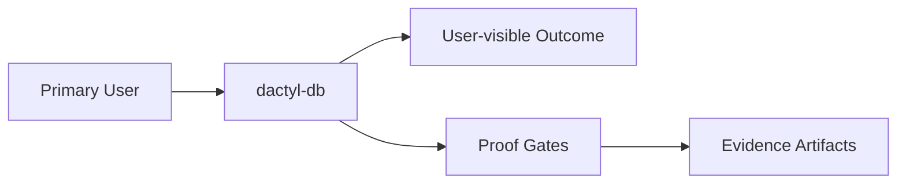

# Intent

<!-- decapod:declared-capabilities:start -->

## Declared Capability Surfaces

- `authentication`
- `background-processing`
- `event-driven`
- `external-integrations`
- `infrastructure-management`
- `persistent-state`
- `public-api`
- `scheduled-jobs`
- `secrets-handling`

<!-- decapod:declared-capabilities:end -->
## Product Outcome
- Establish Dactyl as the governed datastore boundary for Decapod, allowing callers to execute the same query contract against either local SQLite or remote Neon-backed storage without changing application logic. Dactyl must select the requested datastore, analyze SQL before execution, reject unsupported dialect constructs when rewriting is disabled, apply permitted rewrites when enabled, and preserve a narrow public API that does not expose adapter internals.

## What This Project Is
dactyl-db is a not classified yet project built using Rust.
Establish Dactyl as the governed datastore boundary for Decapod, allowing callers to execute the same query contract against either local SQLite or remote Neon-backed storage without changing application logic. Dactyl must select the requested datastore, analyze SQL before execution, reject unsupported dialect constructs when rewriting is disabled, apply permitted rewrites when enabled, and preserve a narrow public API that does not expose adapter internals.

Key operating facts:
- **Primary languages**: Rust
- **Detected surfaces**: not detected yet

## Product View

## Inferred Baseline
- Repository: dactyl-db
- Product type: not classified yet
- Primary languages: Rust
- Detected surfaces: not detected yet

## Scope
| Area | In Scope | Proof Surface |
|---|---|---|
| Core workflow | Define a concrete user-visible workflow | Acceptance criteria + tests |
| Data contracts | Document canonical inputs/outputs | [INTERFACES.md](./INTERFACES.md) and schema checks |
| Delivery quality | Block promotion on broken proof surfaces | [VALIDATION.md](./VALIDATION.md) blocking gates |

## Non-Goals (Falsifiable)
| Non-goal | How to falsify |
|---|---|
| Feature creep beyond the primary outcome | Any PR adds capability not tied to outcome criteria |
| Shipping without evidence | Missing validation artifacts for promoted changes |
| Ambiguous ownership boundaries | Missing owner/system-of-record in interfaces |

## Constraints
- Technical: runtime, dependency, and topology boundaries are explicit.
- Operational: deployment, rollback, and incident ownership are defined.
- Security/compliance: sensitive data handling and authz are mandatory.

## Acceptance Criteria (must be objectively testable)
- [ ] The outcome is complete when equivalent queries across all nine Decapod stores produce equivalent row projections through both adapters, compile-time query analysis works for literal queries, runtime analysis works for dynamic queries, inline datastore directives are honored, and the full formatting, linting, and conformance suite passes.
- [ ] Non-functional targets are met (latency, reliability, cost, etc.).
- [ ] Validation gates pass and artifacts are attached.
- [ ] `cargo test` passes for unit/integration coverage
- [ ] `cargo clippy -- -D warnings` passes with no denied lints
- [ ] `cargo fmt --check` passes on the repo

## Epistemic Custody Fields

### Active Assumptions
- [ ] List any assumptions made to proceed.
- [ ] Flag assumptions that require future verification.

### Confidence & Risk Level
- **Confidence**: Low/Medium/High (Rationale: )
- **Risk**: Low/Medium/High (Impact of wrong assumptions: )

### Measured vs Inferred Facts
| Fact | Source (Provenance) | Type (Measured/Inferred) |
|---|---|---|
| | | |

### Unresolved Contradictions
- [ ] List any evidence that conflicts with current assumptions or intent.

### Deferred Questions
- [ ] Questions to be answered later.

### Stop Conditions
- [ ] Explicit conditions under which the agent should stop and ask for help.

### Proof Required Before Completion
- [ ] Specific evidence needed to prove the outcome is met.

## Tradeoffs Register
| Decision | Benefit | Cost | Review Trigger |
|---|---|---|---|
| Simplicity vs extensibility | Faster iteration | Potential rework | Feature set expands |
| Strict gates vs dev speed | Higher confidence | More upfront discipline | Lead time regressions |

## First Implementation Slice
- [ ] Define the smallest user-visible workflow to ship first.
- [ ] Define required data/contracts for that workflow.
- [ ] Define what is intentionally postponed until v2.

## Open Questions (with decision deadlines)
| Question | Owner | Deadline | Decision |
|---|---|---|---|
| Which interfaces are versioned at launch? | TBD | YYYY-MM-DD | |
| Which non-functional target is hardest to hit? | TBD | YYYY-MM-DD | |

<!-- decapod:codebase-attestation:start -->
## Codebase Attestation

- Repository signal fingerprint: `64345e9a4aeb452ab836313e2cfc83e33d479e10ee48203fe5a16058a39baf0d`
- Significant implementation surfaces: `.github/` (2 files), `Cargo.lock/` (1 files), `Cargo.toml/` (1 files), `README.md/` (1 files), `dactyl-db-macros/` (1 files), `src/` (11 files)
- Refreshed from the current codebase by `decapod specs.refresh`
<!-- decapod:codebase-attestation:end -->
