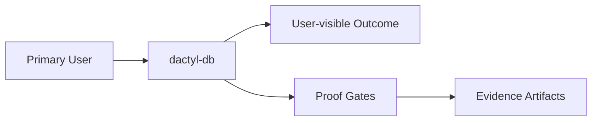

# Intent

<!-- decapod:declared-capabilities:start -->

## Declared Capability Surfaces

- `authentication`
- `background-processing`
- `event-driven`
- `external-integrations`
- `infrastructure-management`
- `persistent-state`
- `public-api`
- `scheduled-jobs`
- `secrets-handling`

<!-- decapod:declared-capabilities:end -->

## Product Outcome
- Establish Dactyl as the small application-layer database provider for read/write-heavy apps, targeted for the v0.7.0 release. The same normalized reads, explicit writes, opaque atomic batches, and access modes must work against a real local SQLite file and remote Vercel Neon without exposing backend handles or adding database administration behavior.

## What This Project Is
dactyl-db is a Rust application driver over a real local SQLite file and remote Vercel Neon. Dactyl selects the physical route, binds application values, delegates SQL execution and file durability to SQLite, forwards remote requests with a versioned opaque storage context, and normalizes rows, write results, atomic results, schema projections, and typed failures. Database administration, schema ownership, migration order, query planning, analytics, retries, idempotency, tenancy, authorization, and business intelligence remain outside the crate.

Key operating facts:
- **Primary languages**: Rust
- **Detected surfaces**: not detected yet

## Product View

## Inferred Baseline
- Repository: dactyl-db
- Product type: not classified yet
- Primary languages: Rust
- Detected surfaces: not detected yet

## Scope
| Area | In Scope | Proof Surface |
|---|---|---|
| Core workflow | Define a concrete user-visible workflow | Acceptance criteria + tests |
| Data contracts | Document canonical inputs/outputs | [INTERFACES.md](./INTERFACES.md) and schema checks |
| Delivery quality | Block promotion on broken proof surfaces | [VALIDATION.md](./VALIDATION.md) blocking gates |

## Non-Goals (Falsifiable)
| Non-goal | How to falsify |
|---|---|
| Feature creep beyond the primary outcome | Any PR adds capability not tied to outcome criteria |
| Shipping without evidence | Missing validation artifacts for promoted changes |
| Ambiguous ownership boundaries | Missing owner/system-of-record in interfaces |

## Constraints
- Technical: runtime, dependency, and topology boundaries are explicit.
- Operational: deployment, rollback, and incident ownership are defined.
- Security/compliance: sensitive data handling and authz are mandatory.
- Context boundary: Decapod owns the meaning of `StorageContext`; Propodus owns
  membership and repository authorization; Dactyl validates only the envelope
  and forwards it to Neon.

## Acceptance Criteria (must be objectively testable)
- [x] Local SQLite proves the backend-neutral fixture matrix in `tests/storage_fixtures.rs`: parameterized reads/writes, explicit keys, conditional CAS/zero-row updates, atomic state-plus-event commit and rollback, read-only rejection, typed constraint errors, concurrent scoped writes, deterministic `DROP` cleanup, and storage-context no-op when cloud tenancy fields are present or absent.
- [x] The same fixture cases run through the Neon adapter against an executing in-process mock; live Propodus/Vercel Neon is recorded as `unavailable` unless `DACTYL_LIVE_PROPODUS_ROUTE` is set, and a skipped live backend is never reported as passed.
- [x] Remote query and atomic requests preserve the versioned opaque context; local operations remain context-neutral; missing remote context fails closed with typed authentication/protocol errors; remote authorization denials surface as `AdapterErrorKind::Authorization`.
- [x] The local route opens real SQLite files through the optional `sqlite` feature. Existing files open unchanged; read/write creation, read-only access, SQLite locking/journaling, typed errors, and the backend-neutral schema projection are covered by tests.
- [x] Issue #77's revised connector requirement is proved by `tests/sqlite_existing.rs`: the checked-in Decapod fixture opens without conversion, preserves catalog and values, accepts updates, reopens successfully, and covers NULL/REAL/blob/generated-key and missing/read-only behavior.
- [ ] Live Propodus/Vercel Neon deployment, route translation, and provider CAS/`version_conflict` proof remain a follow-up issue.
- [ ] Non-functional targets are met (latency, reliability, cost, etc.).
- [ ] Validation gates pass and artifacts are attached.
- [ ] `cargo test` passes for unit/integration coverage
- [ ] `cargo clippy -- -D warnings` passes with no denied lints
- [ ] `cargo fmt --check` passes on the repo

## Epistemic Custody Fields

### Active Assumptions
- [ ] List any assumptions made to proceed.
- [ ] Flag assumptions that require future verification.

### Confidence & Risk Level
- **Confidence**: Low/Medium/High (Rationale: )
- **Risk**: Low/Medium/High (Impact of wrong assumptions: )

### Measured vs Inferred Facts
| Fact | Source (Provenance) | Type (Measured/Inferred) |
|---|---|---|
| | | |

### Unresolved Contradictions
- [ ] List any evidence that conflicts with current assumptions or intent.

### Deferred Questions
- [ ] Questions to be answered later.

### Stop Conditions
- [ ] Explicit conditions under which the agent should stop and ask for help.

### Proof Required Before Completion
- [ ] Specific evidence needed to prove the outcome is met.

## Tradeoffs Register
| Decision | Benefit | Cost | Review Trigger |
|---|---|---|---|
| Simplicity vs extensibility | Faster iteration | Potential rework | Feature set expands |
| Strict gates vs dev speed | Higher confidence | More upfront discipline | Lead time regressions |

## First Implementation Slice
- [x] Define the smallest user-visible workflow: one parameterized application read and one parameterized application write.
- [x] Define the shared route, parameter, row, affected-count, and error contracts.
- [x] Postpone schema administration, migrations, transactions, query analysis, retries, and business intelligence.

## Open Questions (with decision deadlines)
| Question | Owner | Deadline | Decision |
|---|---|---|---|
| Which interfaces are versioned at launch? | TBD | YYYY-MM-DD | |
| Which non-functional target is hardest to hit? | TBD | YYYY-MM-DD | |

<!-- decapod:codebase-attestation:start -->

## Codebase Attestation

- Repository signal fingerprint: `6f2e1e56b2022bf51e9ed4d81a072f996c2a338c2c71f2672bab90e69d7b6786`
- Significant implementation surfaces: `.github/` (3 files), `Cargo.lock/` (1 files), `Cargo.toml/` (1 files), `README.md/` (1 files), `src/` (8 files), `tests/` (1 files)
- Refreshed from the current codebase by `decapod specs.refresh`
<!-- decapod:codebase-attestation:end -->
