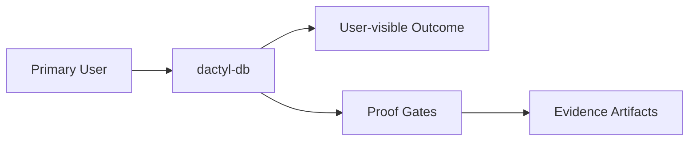

# Intent

## Phase 4 transport load, fairness, cancellation, and regression baseline (issue #144)

- **Aggregate pool limits, cancellation, and FIFO sync/async fairness (`#144`)**: Hardens `src/http_pool.rs`, `src/adapter/neon/mod.rs`, and `src/cloud.rs` so `RequestLimit` enforces FIFO arrival-order slot handoff across synchronous and asynchronous callers without barging or thundering-herd wakeups, drops/cancellations forward granted slots cleanly via `WaiterGuard`, and pre-send `request_timeout` expirations (including after permit acquisition prior to `.send()`) classify consistently as `AdapterErrorKind::Timeout` + `MutationOutcome::NotAttempted`.
- **Reproducible load baseline & Propodus policy boundary (`docs/transport-load-baseline.md`, `tests/transport_load_fairness_144.rs`)**: Documents aggregate pool bounds (`MAX_PROCESS_IN_FLIGHT = 64`, `MAX_LIVE_POOLS = 64`, `MAX_ASYNC_RUNTIMES_PER_POOL = 16`, `http_max_in_flight` `1..=64`), confirms `request_timeout` covers queueing + execution, preserves Dactyl's boundary against tenant admission policy (owned by Propodus), and records sustained/burst fixed-seed latency (`p50`/`p95`/`p99` total, service, queue), active/idle connections, cross-platform FD/RSS deltas, result/wire bytes, and regression thresholds.

## Cross-layer transport fault injection, commit-ack loss reconciliation, and origin cutover resilience (issues #143, #138)

- **Adversarial fault-injection and reference-model campaign (`#143`)**: `tests/transport_fault_reconciliation_143.rs` exercises an instrumented SQLite-backed loopback HTTP/Edge/RPC fault proxy across explicit barriers (pre-send refusals and pool-slot saturation, server admission refusals, pre-commit rollbacks/5xx, commit-ack socket drop, truncated `2xx` responses, late-commit and pre-commit timeouts, connection resets, duplicated JSON bodies, duplicate provenance headers, reordered `attempt_id`/`scope_ref`/`operation_kind` responses, same-key/different-payload `IdempotencyConflict`, `401 use_dpop_nonce` before-effect vs after-effect retry guards, `429` with `Retry-After` and `accepted_not_committed`, mid-flight policy-generation revocations, and bounded reconciliation readback) plus a 12-seed deterministic campaign proving `0` duplicate commits, `0` false rollback/commit classifications, `0` unauthorized commits, and exact `request_id`/`attempt_id`/`policy_generation` correlation.
- **Origin cutover resilience (`#138`)**: Preserves `DEFAULT_CLOUD_ORIGIN` (`"https://goyxpcmxetztjlrrcwew.supabase.co"`) and the no-local-fallback guarantee while testing stale cross-origin discovery profiles, `supabase.co` <-> `api.decapodlabs.ai` coexistence, DPoP `htu` host/path mismatch refusal, unsafe redirect refusal, and commit-ack loss during cutover without resending mutations to the new origin.
- **Transport & classification fixes**: Hardens `src/http_pool.rs`, `src/adapter/supabase.rs`, and `src/cloud.rs` for post-effect `use_dpop_nonce` non-retry, non-2xx `EffectStatus::Uncertain` `MutationOutcome` alignment, pre-send pool/worker `NotAttempted` classification, unadvertised mutating decode fault provenance, `Decapod-Cloud-Request-Id` fault correlation, and `403` DPoP/credential error classification.

## Differential SQLite/Cloud contract hardening and versioned wire compatibility matrix (issues #145, #146)

- **Differential SQLite vs. Cloud contract histories (`#145`)**: `tests/differential_contract.rs` executes deterministic seeded generated operation histories (typed rows, nulls, Unicode, binary/hex blobs, `i64::MIN`/`i64::MAX`/`0`/`-1` boundary integers, `ORDER BY` tie-breaking, generated keys, predicates, mixed read/write batches, CAS/constraint conflicts, keyset cursor pagination, atomic rollback, and malformed/oversized/non-finite inputs) against a pure-Rust reference model, real local `SqliteAdapter`, and a real HTTP `SupabaseAdapter` wire server speaking canonical `dactyl_api` RPC, device-gateway, and legacy service envelopes, with delta-debugging minimal counterexample shrinking, independent storage readback, and explicit non-normalizing capability-refusal checks.
- **Versioned wire and resource-budget compatibility across release skew (`#146`)**: `docs/wire-compatibility-matrix.md` and recorded fixtures under `tests/fixtures/wire_compat/` + `tests/wire_compatibility.rs` document and enforce compatibility rules for `PROVENANCE_CONTRACT_VERSION`, `STORAGE_CONTEXT_VERSION`, `RESOURCE_BUDGET_VERSION`, `SUPABASE_RPC_CONTRACT_VERSION`, `DeploymentProfile`, auth/token envelopes, sync/async parity, and `#138` `https://api.decapodlabs.ai` DPoP `htu` binding across release skew.
- **Hardened driver defects**: `src/rows.rs` rejects out-of-range `u64 > i64::MAX` values in `Parameter::deserialize` instead of wrapping to negative `i64`; `src/adapter/sqlite/mod.rs` enforces `sqlite3_stmt_readonly` on `read`, `visit_rows`, and `OperationKind::Read` queries, guards `last_insert_rowid` on `affected_rows > 0` so 0-row `INSERT OR IGNORE` never leaks stale keys, and rejects non-finite `Parameter::Real` values before execution.

## Staged first-party custom origin cutover readiness (issue #138)

- **Explicit opt-in first-party origin without premature default flip (`#138`)**: `DEFAULT_CLOUD_ORIGIN` (`src/connector.rs`) remains safely pinned to `"https://goyxpcmxetztjlrrcwew.supabase.co"` until live Supabase custom-domain TLS activation, OAuth callback migration, and server-advertised `project_origin` discovery are independently proven. `src/connector.rs`, `src/cloud.rs`, and `src/lib.rs` add unconditional staged exports `FIRST_PARTY_CLOUD_ORIGIN` (`"https://api.decapodlabs.ai"`), `FIRST_PARTY_AUTH_PATH` (`"/auth"`), `FIRST_PARTY_REPO_PATH_PREFIX` (`"/decapod"`), `LogicalTarget::first_party_cloud()`, `LogicalConnector::first_party_cloud()` / `first_party_cloud_async()`, and origin-bound `canonical_auth_url()` / `canonical_repository_url(org, repo)` helpers without altering default `/functions/v1/decapod-onboarding/*` wire routing.

## Runtime-aware HTTP pool budgets, per-operation effect provenance, and onboarding/admin operations (issues #134, #140)

- **Runtime-aware pooled transport and `ResourceBudget` concurrency limits (`#134`)**: `ResourceBudget` (`src/budget.rs`) adds `http_max_in_flight` (default `16`, valid `1..=64`), `http_max_idle_per_host` (default `32`, valid `0..=64`), and `http_idle_timeout` (default `15s`, non-zero) via `with_http_pool_limits`. `src/http_pool.rs`, `src/cloud.rs`, `src/adapter/supabase.rs`, and `src/adapter/neon/mod.rs` share weak-cached `SharedHttpClient` pools with runtime-aware sync pooling (direct `reqwest::blocking::Client` outside Tokio; off-runtime worker init/exec only when called inside Tokio) plus native non-blocking `*_async` operations (`CloudConnector`, `LogicalConnector`, `Connection`, and `Adapter`) using per-runtime pooled `reqwest::Client` instances and `tokio::sync::Notify` permits while keeping Rust `1.85.0` MSRV and `Cargo.toml`/`Cargo.lock` dependencies unchanged.
- **Per-operation authorization and effect provenance (`#140`)**: `src/connector.rs`, `src/http_pool.rs`, `src/cloud.rs`, `src/adapter/supabase.rs`, `src/adapter/mod.rs`, and `src/lib.rs` carry versioned (`PROVENANCE_CONTRACT_VERSION = 1`), origin- and auth-bound `EffectProvenance` (`EffectStatus::{NotAttempted, Refused, CommittedObserved, RolledBack, Uncertain, UnsupportedProvenance}`, `DecisionOutcome::{Allowed, Refused}`, `ObservationSource::{DirectResponse, ServerReadback, LocalPreflight, TransportFault}`) and `OperationAttempt` identity across `Connection::write_with_attempt*`, `atomic_with_attempt*`, `CloudConnector` / `LogicalConnector` `*_with_attempt*`, and separate idempotent `reconcile_operation*` / `reconcile_control_attempt*` (`ReconciliationObservation`). Mutating operations never auto-retry post-send disconnects; readback reconciliation leaves earlier `Uncertain` client failure metadata immutable while surfacing same-attempt/different-digest `AdapterErrorKind::IdempotencyConflict`, and local SQLite retains full policy-free compatibility.
- **Propodus onboarding & organizational admin operations**: `AccountOperation` (`src/connector.rs`) adds `RepositoryEnroll` (`"repository-enroll"`, mutating), `ResourceLimits` (`"resource-limits"`, non-mutating), `OrgAdmins` (`"org-admins"`, mutating), `OrgRecovery` (`"org-recovery"`, mutating), `PolicyTemplates` (`"policy-templates"`, mutating), and `OrgUpgrades` (`"org-upgrades"`, mutating). `AccountOperation::requires_human_bearer()` requires human `Bearer` tokens across all onboarding/admin operations except `DeviceRefresh` and `DeviceRevoke`, rejecting `dpc_at_` device session tokens and invalid/missing credentials locally before dispatch (`AdapterErrorKind::Authentication` / `Protocol`, `MutationOutcome::NotAttempted`, `EffectStatus::NotAttempted`).

## Wave 2 Decapod Cloud Edge gateway, RFC 9449 retry, billing overage, runtime selector, and multi-org conformance (issues #132, #133, #136, #137, #138, #139)

- **Proof profile & runtime selector reconciliation (`#137`)**: `.decapod/config.toml` reconciles `[proof.required_profile].reviewed_sources_digest` (`sha256:635177a3b555fa2d1f95a28c13c87515cacbc1e73c4a627c6d4c981a8f1db665`) against accepted `dactyl-db 0.18.0` and pins `tools/proof/Containerfile` to `decapod =0.162.1` (which ships release-only inventory transition qualification so routine crate cuts clear `#137` without `policy.db`) while keeping `Cargo.toml`/`Cargo.lock`, `.github/workflows/*`, `reviewed_commands_digest`, and `DEFAULT_CLOUD_ORIGIN = "https://goyxpcmxetztjlrrcwew.supabase.co"` unchanged. `Backend::datastore()` and `Datastore::as_str()` (`src/lib.rs`) map logical workspace backends directly to runtime datastores without reading process environment variables.
- **Billing overage and error preservation (`#132`)**: `AccountOperation` adds `BillingOveragePolicy` (`"billing-overage-policy"`, mutating), `DeviceKeys` (`"device-keys"`, read), `DeviceSessions` (`"device-sessions"`, read), `DeviceSession` (`"device-session"`, mutating), and `DeviceRefresh` (`"device-refresh"`, mutating); `CloudResponseMetadata` exposes bounded `retry_after()`; HTTP `429` preserves `quota_exceeded` and `overage_cap_exhausted` as `AdapterErrorKind::Quota` (keeping `rate_limited` as `RateLimited`); HTTP `403` preserves `provider_disabled`, `mfa_step_up_required`, and `repo_access_denied` as `Authorization`; and HTTP `401` preserves `device_key_expired` and `refresh_reuse_detected` as `Authentication`.
- **Bounded single-retry `use_dpop_nonce` (`#133`)**: When a `RequestProofSigner` emits `AuthScheme::DPoP` and the server responds with HTTP `401` (`use_dpop_nonce` body code or `WWW-Authenticate: DPoP error="use_dpop_nonce"`) plus a single valid bounded `DPoP-Nonce` header, `CloudConnector` and `SupabaseRpc` notify `observe_nonce`, re-sign once, retry at most once per logical call, surface final response headers in `CloudResponseMetadata`, stop on double challenges, and never retry `AuthScheme::Bearer` or ambiguous post-send `outcome_unknown` failures.
- **Edge gateway routing and event conformance (`#136`)**: Opt-in `.with_device_gateway()` routes `AuthScheme::DPoP` datastore and control RPCs through `/functions/v1/decapod-onboarding/{cloud-query,cloud-batch,cloud-control}` (with HTTP `404` fallback on `cloud-control` to `/functions/v1/propodus-onboarding/cloud-control`), enforces gateway-side Bearer vs DPoP requirements per `AccountOperation` while retaining legacy `/rest/v1/rpc/*` behavior when disabled, and adds `tasks` + `events` (`dactyl_event_v1`) post-state `WITH event_params(...)` conformance to `tests/fixtures/supabase-service-schema.sql` and `tests/supabase_service.rs`.
- **Multi-org/multi-repo single-origin isolation (`#138`, `#139`)**: Wire tests prove multiple organizations and repositories operate concurrently over a single trusted origin without credential leakage, redirect following, cross-tenant state mixing, or SQLite fallback.

## Decapod Cloud transport, caller-supplied DPoP, and extended conformance (issues #127, #128, #129)

Dactyl exposes two primary logical workspace targets: local SQLite (`LogicalTarget::local`) and Decapod Cloud (`LogicalTarget::cloud`, backed by native Supabase RPC). For `dactyl-db 0.18.0`, Dactyl adds:
- A narrow synchronous `RequestProofSigner` trait (`src/connector.rs`, `src/http_pool.rs`, `src/cloud.rs`, `src/adapter/supabase.rs`, `src/lib.rs`) receiving `(method, canonical_url, access_token_sha256, nonce)` so callers can attach RFC 9449 `DPoP` proofs (`Authorization: DPoP <token>` + `DPoP: <proof>`) or explicit `Bearer` compatibility mode (`RequestProof::bearer()`) across `DatastoreRoute::supabase_rpc`, `CloudConnector::control_request`, and `CloudConnector::account_request` (and `LogicalConnector`). Dactyl remains free of key generation, OS keystore custody, browser flows, and identity/billing policy.
- Fixed onboarding actions `DeviceChallenge`, `DeviceEnroll`, `DeviceStepUp`, and `DeviceRevoke` on `AccountOperation`, preserving `is_mutating()` (`DeviceChallenge` non-mutating; enrollment/step-up/revocation mutating with `outcome_unknown` / `MutationOutcome::Uncertain` on post-dispatch loss).
- Canonical `/functions/v1/decapod-onboarding` discovery/handoff/account routes with bounded HTTP `404` fallback to legacy `/functions/v1/propodus-onboarding` during cutover, plus redacted bounded `Decapod-Cloud-*`, `Sunset`, `Deprecation`, and `DPoP-Nonce` header capture in `CloudResponseMetadata`.
- Extended native/backend-neutral conformance (`tests/conformance.rs`, `tests/supabase_rpc.rs`, `tests/control_rpc.rs`, `tests/cloud_connector.rs`, `tests/resource_budgets.rs`) covering atomic lease-fencing CAS batches, bounded cursor pagination over compact operational stores, opaque commit-bound proof-transition `control_request` envelopes, deterministic `401`/`403`/`409`/`413`/`429`/`5xx` outcome classification, and a 250-way concurrent burst verifying bounded connection reuse (`<= 32` active slots), zero FD leaks, and strict `ResourceBudget` timeout enforcement.

## Existing Supabase provider qualification (issue 91)

Dactyl provides a small generic Rust datastore and managed-auth transport over SQLite, explicit Neon/Supabase HTTP services and native Supabase RPC. The third provider is implemented in accepted source; issue 91 now aggregates remaining qualification rather than recreating it. docs/supabase-service.md separates the compatibility /query and /batch route from logical Backend::Cloud discovery and native RPC. Propodus is the private SQL/Auth/onboarding infrastructure boundary; no generic Go task server is required. Decapod owns local/cloud UX and durable private user-session custody. Issues 70, 79, 85 and 94 respectively own hosted execution, capability inventory, adversarial proof and registry handoff. Published source and synthetic tests never imply managed OAuth, pooler-mode or deployment acceptance.

## Resource budgets, streaming reads, and catalog predicates (issue 101)

Dactyl measures its repository-local dogfooding database (`docs/datastore/dogfooding-inventory.json`) and bounds per-operation and per-batch resource growth across SQLite, Neon, and Supabase through an additive, versioned `ResourceBudget` (`RESOURCE_BUDGET_VERSION = 1` in `src/budget.rs`), `Connection::open_with_budget` / `Connection::visit_rows`, single-statement local catalog predicates (`Connection::has_table`, `Connection::has_column`), and explicit `FailureOrigin` / `MutationOutcome` classification (`src/error.rs`). Existing `OpenOptions { access_mode, lock_timeout }` struct literals, `Rows` / `Row` callers, `SnapshotLimits`, `DactylError` / `AdapterErrorKind` variants, and Neon / Supabase wire envelopes remain source- and wire-compatible. Dactyl continues to own only physical execution and local maintenance; schema meaning, content-addressed component tables, retry/idempotency policy, and cross-connection concurrency limits remain caller-owned.

## Supported consumers and dependency resolution

Dactyl keeps the same datastore and managed-session APIs while requiring Rust
and Cargo 1.85 in this next-0.x-minor proposal. The prior inactive Quinn upper
bound kept Cargo 1.75 resolution possible but prevented a consumer from selecting
the patched protocol package. `Cargo.toml` now requires quinn-proto >=0.11.19
without enabling HTTP/3. Both the repository and a fresh consumer lock must meet
that floor; the full existing feature, lint, package and MSRV proof remains
required through `tools/proof/check.py`. No package publication or hosted rollout
is established by this change.

## Bounded diagnostic snapshots

The `dactyl-db` crate provides consistent, bounded physical reads for Decapod's
native storage inventory. Callers retain semantic schema and history ownership.
Snapshot inspection requires a dedicated read-only handle; unsupported remote
adapters fail explicitly without introducing a second schema or maintenance path.

## Logical backend access and user sessions

Applications expose per-workspace local/cloud selection; Dactyl resolves SQLite
or the native Supabase connector through `Backend`, `LogicalTarget`,
`LogicalConnector`, `DatastoreRoute::for_backend`, and `CloudConnector` in
`src/lib.rs`, `src/connector.rs`, and `src/cloud.rs` without ambient environment
variables or process-global connector state. Portable connector, session, and
account types (`LogicalTarget`, `LogicalConnector`, `AuthenticationSecrets`,
`AuthenticationStart`, `UserSession`, `AccountOperation`, `ScmProvider`,
`ScmCredential`, `DEFAULT_CLOUD_ORIGIN`) compile across all Cargo feature
combinations so consumers never re-gate session/account models. Propodus names
the IaC for the hosted backend. Dactyl discovers its public deployment profile,
fails closed without SQLite fallback when discovery or compilation fails, and
transports managed Auth requests, account readiness/billing requests
(`Register`, `Status`, `Quote`, `Checkout`, `Manage`, `Portal`), and
current-user RPC credentials. The application retains browser interaction,
durable pending-flow state and private session custody. Ordinary cloud authority
is the authenticated Supabase user and active assigned seat within the
tenant/project. Linked code-host identities and separately scoped governance
grants remain backend policy; repository permissions are not mirrored as
ordinary data authority. Post-send transport or truncation failures on mutating
or one-time requests surface `outcome_unknown` so callers never blindly replay
ambiguous writes. Offline connector/auth fixtures (`tests/logical_connector.rs`,
`tests/cloud_connector.rs`) establish local SQLite and synthetic HTTP transport
behavior only; `local_postgres`, `hosted_supabase`, and `live_propodus` OAuth,
checkout, and deployed profile availability remain separate rollout evidence and
are recorded as `unavailable` when unexercised.

## Secure shared-directory SQLite recovery

Explicit SQLite recovery supports intentionally shared Unix storage without exposing rebuild contents. Dactyl owns fresh private same-filesystem staging; callers retain filesystem policy and must quiesce clients and filesystem writers. No automatic repair or consumer integration is added.

## Product Outcome
- Establish Dactyl as the small application-layer database provider for read/write-heavy apps, targeted for the v0.7.0 release. The same normalized reads, explicit writes, opaque atomic batches, and access modes must work against a real local SQLite file and remote Vercel Neon without exposing backend handles or adding database administration behavior.

## What This Project Is
dactyl-db is a Rust application driver over a real local SQLite file and remote Vercel Neon. Dactyl selects the physical route, binds application values, delegates SQL execution and file durability to SQLite, forwards remote requests with a versioned opaque storage context, and normalizes rows, write results, atomic results, schema projections, and typed failures. Database administration, schema ownership, migration order, query planning, analytics, retries, idempotency, tenancy, authorization, and business intelligence remain outside the crate.

Issue #88 adds one deliberately narrow physical-storage responsibility: Dactyl
defines explicit verification, online backup, and logical dump/reload recovery
for local SQLite. It does not auto-repair on startup or expose raw SQLite or
Decapod-specific recovery behavior. Operators select recovery explicitly,
preserve the original file and sidecars, and receive typed, auditable results.

Key operating facts:
- **Primary languages**: Rust
- **Detected surfaces**: not detected yet

## Product View

```mermaid
flowchart LR
  U[Primary User] --> P[dactyl-db]
  P --> O[User-visible Outcome]
  P --> G[Proof Gates]
  G --> E[Evidence Artifacts]
```

## Inferred Baseline
- Repository: dactyl-db
- Product type: not classified yet
- Primary languages: Rust
- Detected surfaces: not detected yet

## Scope
| Area | In Scope | Proof Surface |
|---|---|---|
| Core workflow | Define a concrete user-visible workflow | Acceptance criteria + tests |
| Data contracts | Document canonical inputs/outputs | [INTERFACES.md](./INTERFACES.md) and schema checks |
| Delivery quality | Block promotion on broken proof surfaces | [VALIDATION.md](./VALIDATION.md) blocking gates |

## Non-Goals (Falsifiable)
| Non-goal | How to falsify |
|---|---|
| Feature creep beyond the primary outcome | Any PR adds capability not tied to outcome criteria |
| Shipping without evidence | Missing validation artifacts for promoted changes |
| Ambiguous ownership boundaries | Missing owner/system-of-record in interfaces |

## Constraints
- Technical: runtime, dependency, and topology boundaries are explicit.
- Operational: deployment, rollback, and incident ownership are defined.
- Security/compliance: sensitive data handling and authz are mandatory.
- Context boundary: Decapod owns the meaning of `StorageContext`; Propodus owns
  membership and repository authorization; Dactyl validates only the envelope
  and forwards it to Neon.

## Acceptance Criteria (must be objectively testable)
- [x] Local SQLite proves the backend-neutral fixture matrix in `tests/storage_fixtures.rs`: parameterized reads/writes, explicit keys, conditional CAS/zero-row updates, atomic state-plus-event commit and rollback, read-only rejection, typed constraint errors, concurrent scoped writes, deterministic `DROP` cleanup, and storage-context no-op when cloud tenancy fields are present or absent.
- [x] The same fixture cases run through the Neon adapter against an executing in-process mock; live Propodus/Vercel Neon is recorded as `unavailable` unless `DACTYL_LIVE_PROPODUS_ROUTE` is set, and a skipped live backend is never reported as passed.
- [x] Remote query and atomic requests preserve the versioned opaque context; local operations remain context-neutral; missing remote context fails closed with typed authentication/protocol errors; remote authorization denials surface as `AdapterErrorKind::Authorization`.
- [x] The local route opens real SQLite files through the optional `sqlite` feature. Existing files open unchanged; read/write creation, read-only access, SQLite locking/journaling, typed errors, and the backend-neutral schema projection are covered by tests.
- [x] Issue #77's revised connector requirement is proved by `tests/sqlite_existing.rs`: the checked-in Decapod fixture opens without conversion, preserves catalog and values, accepts updates, reopens successfully, and covers NULL/REAL/blob/generated-key and missing/read-only behavior.
- [x] Issue #88's local maintenance contract is proved by `tests/sqlite_maintenance.rs`: healthy verification, WAL/SHM-aware online backup, damaged-index detection where `REINDEX` fails, verified logical recovery, metadata/data preservation, DELETE journal-mode behavior, atomic archive conflict handling, same-process open-connection refusal, and bounded lock errors.
- [x] The additive maintenance methods remain local-only; the Neon contract returns typed capability errors without network calls.
- [ ] Live Propodus/Vercel Neon deployment, route translation, and provider CAS/`version_conflict` proof remain a follow-up issue.
- [ ] Non-functional targets are met (latency, reliability, cost, etc.).
- [ ] Validation gates pass and artifacts are attached.
- [ ] `cargo test` passes for unit/integration coverage
- [ ] `cargo clippy -- -D warnings` passes with no denied lints
- [ ] `cargo fmt --check` passes on the repo

## Epistemic Custody Fields

### Active Assumptions
- [ ] List any assumptions made to proceed.
- [ ] Flag assumptions that require future verification.

### Confidence & Risk Level
- **Confidence**: Low/Medium/High (Rationale: )
- **Risk**: Low/Medium/High (Impact of wrong assumptions: )

### Measured vs Inferred Facts
| Fact | Source (Provenance) | Type (Measured/Inferred) |
|---|---|---|
| | | |

### Unresolved Contradictions
- [ ] List any evidence that conflicts with current assumptions or intent.

### Deferred Questions
- [ ] Questions to be answered later.

### Stop Conditions
- [ ] Explicit conditions under which the agent should stop and ask for help.

### Proof Required Before Completion
- [ ] Specific evidence needed to prove the outcome is met.

## Tradeoffs Register
| Decision | Benefit | Cost | Review Trigger |
|---|---|---|---|
| Simplicity vs extensibility | Faster iteration | Potential rework | Feature set expands |
| Strict gates vs dev speed | Higher confidence | More upfront discipline | Lead time regressions |

## First Implementation Slice
- [x] Define the smallest user-visible workflow: one parameterized application read and one parameterized application write.
- [x] Define the shared route, parameter, row, affected-count, and error contracts.
- [x] Postpone schema administration, migrations, transactions, query analysis, retries, and business intelligence.

## Open Questions (with decision deadlines)
| Question | Owner | Deadline | Decision |
|---|---|---|---|
| Which interfaces are versioned at launch? | TBD | YYYY-MM-DD | |
| Which non-functional target is hardest to hit? | TBD | YYYY-MM-DD | |

<!-- decapod:declared-capabilities:start -->

## Declared Capability Surfaces

These declarations select authoring and proof obligations; they do not attest implemented runtime guarantees.

- `authentication`
- `background-processing`
- `event-driven`
- `external-integrations`
- `infrastructure-management`
- `persistent-state`
- `public-api`
- `scheduled-jobs`
- `secrets-handling`

<!-- decapod:declared-capabilities:end -->

<!-- decapod:codebase-contract:start -->

## Codebase Contract Snapshot

- Tracked significant codebase files: 60 across `.github/` (4), `Cargo.lock/` (1), `Cargo.toml/` (1), `README.md/` (1), `examples/` (1), `src/` (19), `tests/` (30), `tools/` (3)
- Core modules: 12 | Workflows: 4 | Integration targets: 27
<!-- decapod:codebase-contract:end -->

<!-- decapod:codebase-attestation:start -->

## Codebase Attestation

- Repository signal fingerprint: `d48c9e1e1cd75ab5e3686715792172387e10225b2b045bd903caa1e115775a6f`
- Significant implementation surfaces: `.github/` (4 files), `Cargo.lock/` (1 files), `Cargo.toml/` (1 files), `README.md/` (1 files), `examples/` (1 files), `src/` (19 files), `tests/` (30 files), `tools/` (3 files)
- Refreshed from the current codebase by `decapod rpc --op specs.refresh`
<!-- decapod:codebase-attestation:end -->

## Supabase provider boundary (issue 91)

Add an opt-in third provider selected at connection construction. Existing
SQLite and Neon configurations, features, defaults and operation contracts stay
compatible. Supabase clients use authenticated HTTPS with user bearer credentials
and the opaque versioned StorageContext. Database passwords and service-role
keys belong exclusively to a separately authorized service/operator boundary.
No native Postgres transport, deployment, data migration, or identity policy is
introduced by the client adapter.

## Native read-only batch boundary

The generic native connector selects a separate physically read-only atomic batch boundary. Identity issuance and effective authorization remain service-owned; local and legacy transports retain their existing contracts.

## Authenticated control transport (issue 123)

The public connector also carries opaque single-argument native control RPCs for
applications using their existing managed user session. Repository-access
status/delegation/revocation/evaluation remain Propodus policy, independently
enforced against verified identity and accepted policy. A transport success or
caller owner label is never authority. No billing route, policy interpreter or
local fallback is introduced; existing SQL and owner-repair batch consumers
retain their contracts. Source readiness, registry release and deployed
authorization acceptance are separate outcomes.
