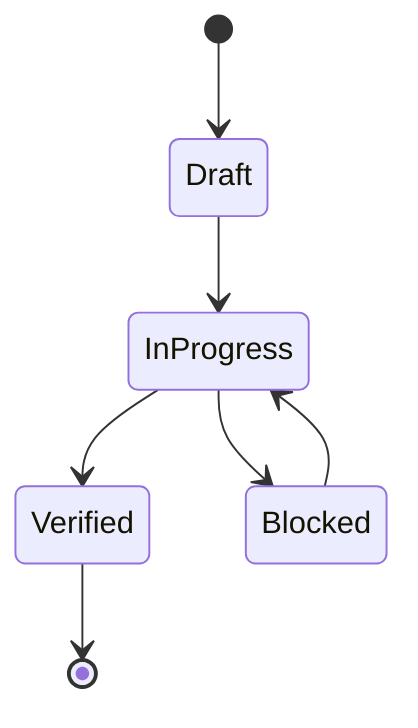

# Semantics

## State Machines

## Invariants
| Invariant | Type | Validation |
|---|---|---|
| No promoted change without proof | System | validation gate |
| Canonical source-of-truth per entity | Data | interface/spec review |
| Mutation events are replayable | Data | deterministic replay |

## Event Sourcing Schema
| Field | Type | Description |
|---|---|---|
| event_id | string | globally unique event id |
| aggregate_id | string | entity/workflow id |
| event_type | string | semantic transition |
| payload | object | transition data |
| recorded_at | timestamp | append time |

## Replay Semantics
- Replay order:
- Conflict resolution:
- Snapshot cadence:
- Determinism proof strategy:

## Error Code Semantics
- Namespace:
- Stable compatibility window:
- Mapping to retry/degrade behavior:

## Domain Rules
- Local conditional writes report stale CAS as `affected_rows = 0`. Dactyl does not promote a local zero-row update into `VersionConflict`; that code is a remote/provider outcome.
- Local storage ignores `StorageContext`. Cloud-only tenancy fields are not required, stored, or interpreted. The same local SQL has the same result with or without a context envelope.
- Concurrent local writers serialize on the route lock file. Cleanup is a caller-owned `DROP TABLE` / `DROP INDEX`; Dactyl does not retain scoped test schemas.
- A local route is a real SQLite database. Read/write opens may create the requested file; read-only opens require it to exist. SQLite owns file-format compatibility, locking, journaling, and recovery. Dactyl configures foreign-key enforcement and the caller's busy timeout.
- Atomic local batches begin one SQLite transaction and roll back the entire batch on any operation failure. Dactyl does not import, convert, snapshot, or rewrite local database files.

## Idempotency Contracts
| Operation | Idempotency Key | Duplicate Behavior |
|---|---|---|
| create/update mutation | request_id | return original result |
| async enqueue | event_id | ignore duplicate enqueue |

## Language Note
- Primary language inferred: Rust<!-- decapod:codebase-attestation:start -->

## Codebase Attestation

- Repository signal fingerprint: `d577d6f04f4dc668f2833f953cdd4c3854c28b689bbdff85e5a9b2343e46641c`
- Significant implementation surfaces: `.github/` (4 files), `Cargo.lock/` (1 files), `Cargo.toml/` (1 files), `README.md/` (1 files), `src/` (9 files), `tests/` (1 files)
- Refreshed from the current codebase by `decapod specs.refresh`
<!-- decapod:codebase-attestation:end -->
